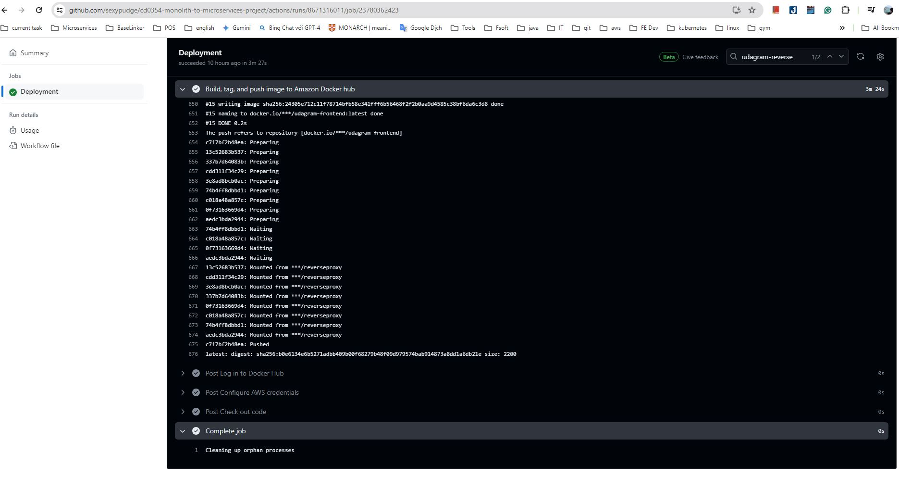

# Screenshots:
* check folder for all screenshot: ./screenshots

## NOTE: I'm more familiar with Github Action so I decided to use it to deploy Udagram App easily

## Deployment Pipeline: 
## GitHub Action
* For pipeline config of GitHub Action, Please check 
[deploy.yml](..%2F.github%2Fworkflows%2Fdeploy.yml)

* For DockerHub I used to push my images to, please visit:
* https://hub.docker.com/u/luongnv1810

* GitHub Action Secret Env setting:
* 

* Everytime we commit code to Github repo, Github Action will automatically detect it and start runnin the pipeline 
*[deploy.yml](..%2F.github%2Fworkflows%2Fdeploy.yml) 

* Screenshot showing a successful build and deploy job, check 
* 

## Kubernetes: please check folder ./screenshots for below info
* A screenshots of kubectl commands show the Frontend and API projects deployed in Kubernetes.
* 

* To verify Kubernetes pods are deployed properly:
```bash
kubectl get pods
```
* 


* To verify Kubernetes services are properly set up:  
```bash
kubectl describe services
```
* 
* 
* 


* To verify that you have horizontal scaling set against CPU usage:
```bash
kubectl describe hpa
```
* 


* To verify that you have set up logging with a backend application:
```bash
kubectl logs {pod_name}
```


* Kubernetes services are replicated. At least one of the Kubernetes services has replicas: defined with a value greater than 1 in itsdeployment.yml file
* 
* 


* Screenshot of Kubernetes services shows a reverse proxy
* 